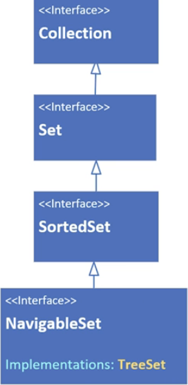

# 有順序的 Set
如果你需要一個有順序的 Set，你會想要考慮 LinkedHashSet 或 TreeSet

LinkedHashSet 會維護元素的插入順序

TreeSet 是一個排序集合，根據元素的自然順序排序，或者在建立集合時指定所需的排序方式

### LinkedHashSet 的結構與可預測性

LinkedHashSet 結合了雜湊表與雙向鏈結串列的優點
它保證了迭代時的順序與資料加入（Insertion）的順序完全一致

LinkedHashSet 繼承了 HashSet 類別

LinkedHashSet 的所有方法都與 HashSet 的方法相同


```java
// 使用 LinkedHashSet 維護插入順序
Set<String> linkedSet = new LinkedHashSet<>();
linkedSet.add("Zebra");
linkedSet.add("Apple");
linkedSet.add("Mango");

// 輸出結果必為: [Zebra, Apple, Mango]
System.out.println("LinkedHashSet 順序: " + linkedSet); 

// 邏輯說明：底層透過 Doubly Linked List 紀錄每個 Entry 的先後順序，
// 即使元素被重新雜湊到不同的 Bucket，鏈結關係依然保留，確保順序可預測。
```

### TreeSet 的排序邏輯 (Sorted Collection)
與 LinkedHashSet 僅紀錄插入先後不同
TreeSet 會根據內容進行排序
這通常依賴於元素的 Comparable 實作或外部傳入的 Comparator

```java
// 使用 TreeSet 進行自動排序
Set<String> treeSet = new TreeSet<>();
treeSet.add("Zebra");
treeSet.add("Apple");
treeSet.add("Mango");

// 輸出結果必為字母排序: [Apple, Mango, Zebra]
System.out.println("TreeSet 順序: " + treeSet);

// 規則遵守：TreeSet 要求存入的物件必須實作 Comparable 介面
// 否則在執行 add 操作時會拋出 ClassCastException
```

### TreeSet 的核心結構與演算法：介紹 TreeSet 如何利用二元搜尋樹（Binary Search Tree）的變體與二元搜尋的概念來實現高效檢索

TreeSet 內部使用的是一種源自於二元搜尋樹（Binary Search Tree，簡稱 BST）的結構。

TreeSet 非使用雜湊表，而是使用「紅黑樹」（Red-Black Tree）
這是一種自平衡二元搜尋樹
它確保了樹的高度平衡，從而使搜尋、插入和刪除操作都能保持穩定的效率

```java
// 使用 TreeSet 儲存字串，字串已實作 Comparable (自然排序)
NavigableSet<String> treeSet = new TreeSet<>();
treeSet.add("Mickey");
treeSet.add("Ann");
treeSet.add("Robin");

// 輸出結果會依字母順序：[Ann, Mickey, Robin]
System.out.println(treeSet);

// 註解：加入元素時，TreeSet 會根據 compareTo() 的結果決定將元素放在左子樹還是右子樹。
```

- 如果不這樣做會導致：若使用 HashSet，元素的順序將會是混亂且不可預測的（chaotic），無法滿足需要「依大小排序」或「範圍查找」的業務需求


### 時間複雜度對比：比較 HashSet的O(1)與TreeSet的 O(log n)，分析兩者在效能與功能間的權衡

與 HashSet 的 $O(1)$（常數時間）不同
TreeSet 的操作複雜度為 $O(\log n)$
這意味著當元素數量翻倍時，操作成本僅增加一個微小的定值

| 操作       | HashSet | TreeSet  |
| -------- | ------- | -------- |
| add      | O(1)    | O(log n) |
| remove   | O(1)    | O(log n) |
| contains | O(1)    | O(log n) |


```java
// 在擁有 1,000,000 個元素的 TreeSet 中尋找一個值
// 大約只需要 20 次比較 (log2(1,000,000) ≈ 20)
boolean exists = treeSet.contains("Ann"); 

// 註解：雖然 O(log n) 比 O(1) 慢，但對於排序集合來說，這已經是非常高效的查找方式。
```


### 導航與排序介面：列舉 SortedSet 與 NavigableSet 介面提供的進階操作方法（如 first、ceiling 等）

由於底層是有序的樹狀結構，TreeSet 提供了遠超普通 Set 的導航方法，允許我們尋找最接近的值或取得子集合

```java
NavigableSet<Integer> numbers = new TreeSet<>(List.of(10, 20, 30, 40, 50));

// 尋找「大於等於」25 的最小元素 (ceiling)
Integer ceilingValue = numbers.ceiling(25); // 結果: 30

// 尋找「小於等於」25 的最大元素 (floor)
Integer floorValue = numbers.floor(25);     // 結果: 20

// 註解：這些方法依賴於紅黑樹的有序遍歷與平衡特性，在無序的 HashSet 中無法直接實現。
```

- 如果不這樣做會導致：在 HashSet 中，你必須遍歷整個集合（$O(n)$）並自行撰寫比較邏輯才能找到最接近的值，代碼既冗長又低效

`

### 排序契約（Sort Contract）：說明放入 TreeSet 的元素必須實作 Comparable 或在建立時提供 Comparator 的必要性

TreeSet 的運作完全仰賴元素的「可比性」來建立樹狀組織。

```java
// 錯誤範例：假設 Task 類別沒有實作 Comparable
// Set<Task> badSet = new TreeSet<>(); 
// badSet.add(new Task()); // 這裡會拋出 ClassCastException

// 正確做法：在建構子傳入 Comparator 定義平衡與組織規則
Set<Task> goodSet = new TreeSet<>(Comparator.comparing(Task::getPriority));
goodSet.add(new Task("High Priority")); 

// 註解：如果物件沒有自然排序，必須明確指定 Comparator，否則 TreeSet 無法決定樹的生長方向與平衡位置。
```

- 如果不這樣做會導致：程式會拋出 ClassCastException，因為 TreeSet 內部會嘗試將物件強制轉型為 Comparable 以進行大小比對並決定其在樹中的位置


### 解決排序契約問題 (Comparable vs Comparator)
當自定義物件（如 Contact）未實作 Comparable 介面時
TreeSet 無法決定排序邏輯
會在執行時期拋出錯誤
解決方案是在建構時明確提供 Comparator

String、Integer 等內建型態本身已實作 Comparable（具備自然排序），因此可以免傳 Comparator 直接使用空建構子

```java
// 定義排序邏輯：按聯絡人姓名排序
Comparator<Contact> mySort = Comparator.comparing(Contact::getName);

// 正確的做法：將 Comparator 傳入建構子
NavigableSet<Contact> sorted = new TreeSet<>(mySort); // 解決了無法轉型 Comparable 的問題
sorted.addAll(phones); // 安全地加入資料

// 註解：這行代碼指定了樹狀組織的比較規則，即使 Contact 沒實作 Comparable 也能運作。
```

### 基於現有集合建立排序

TreeSet 的建構子非常靈活
可以接受另一個 SortedSet 作為參數，並自動繼承其排序規則與數據

```java
// 透過現有的 sorted 集合建立 fullSet
NavigableSet<Contact> fullSet = new TreeSet<>(sorted); 

// 加入更多數據
fullSet.addAll(emails); 

// 註解：fullSet 會延用 sorted 的排序機制（即 mySort 的邏輯），並自動處理重複數據。
```

### 邊界元素查找：SortedSet vs Collections

雖然 java.util.Collections 提供 min 與 max 方法
但對於 SortedSet 而言，直接調用 first() 與 last() 更為高效且直觀
```java
// 方法 A：使用 SortedSet 原生方法 (推薦)
Contact firstContact = fullSet.first(); // 取得最小元素
Contact lastContact = fullSet.last();   // 取得最大元素

// 方法 B：使用 Collections 工具類 (需手動傳入 comparator)
Contact minContact = Collections.min(fullSet, fullSet.comparator());

// 註解：原生 first/last 方法利用樹結構特性，直接定位邊界節點，不需遍歷整個集合。
```


### 提取元素 (Polling Mechanism)
NavigableSet 提供了 pollFirst() 與 pollLast() 方法
這在處理「優先順序任務佇列」時非常有用
```java
// 建立副本以保護原始數據
NavigableSet<Contact> copiedSet = new TreeSet<>(fullSet);

// 提取並移除第一個元素
Contact removed = copiedSet.pollFirst(); 

// 註解：此方法兼具「檢索 (get)」與「移除 (remove)」的功能。
``` 
 
### The TreeSet interface hierarchy
 


 ### TreeSet 的元素排序要求
放入 TreeSet 的元素必須具備「可比性」，主要有以下兩種方式來決定順序：

自然排序（Natural Order）：元素類別本身必須實作 Comparable 介面（例如 Java 內建的 String、Integer 等）

自訂比較器（Comparator）：如果元素類別沒有實作 Comparable
在建立 TreeSet 時，就必須在建構子中傳入一個 Comparator 物件
否則程式在執行時會拋出異常


| 實作類別       | 排序與順序特性             | 底層結構與成本           |
| ------------- | ------------------------ | ------------------------------ |
| HashSet       | 無序 , 無法保證元素的存取順序    | 效能最好，底層使用 HashMap      |
| LinkedHashSet | 預測順序 , 依照「插入順序」進行迭代 | 效能略低於 HashSet，因多了雙向鏈結串列維護順序（Doubly Linked List），有額外記憶體成本 |
| TreeSet       | 排序順序。依照元素「大小 / 字母順序」自動排序 | 底層為紅黑樹（Red-Black Tree），插入與刪除會自動維持排序，成本較高     |
