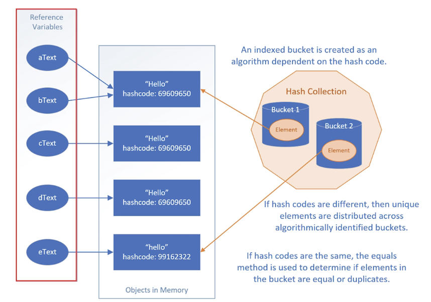

# 探討為何大數據量下需要雜湊技術，將查詢時間從 $O(n)$ 降低到更高效的水平

# The Bucket System：介紹雜湊碼（Hash Code）如何搭配容量聲明，將物件分配到不同的「桶子（Buckets）」中以優化檢索


當集合很大時，逐一比對元素 O(n)太慢

Hashing 透過計算「雜湊碼 HashCode」
將物件分配到不同的「Bucket」中

Hashing　是　透過某種計算規則，快速決定資料應該去哪一區

原理：如果兩個物件的 HashCode 指向不同桶位，它們絕對不相等

```
有 hashing 後：

先算 hashCode
→ 找到 bucket
→ 只搜尋那一小區

變成接近：O(1)
```

Hashing 比「普通分類」更厲害

因為它：不是人手動分類，

而是：透過 hashCode()自動把資料轉成數字。

例如：
```
"apple"  -> 93029210
"banana" -> -1396355227
```
再決定去哪個 bucket。

所以 Hashing = 用數學規則自動分類


# 物件相等性（Object Equality）：釐清 == 運算子與 equals() 方法的差異，這是判斷重複元素的基礎

Object 的兩個重要方法
```java
public boolean equals(Object obj) {
    return (this == obj); // same reference to a single object in memory.
}
```

```java
public int hasCode()
```

# HashSet 如何判斷「重複性」，以及為什麼 equals() 和 hashCode() 這兩個方法必須相輔相成



HashSet 如何判斷「重複元素」


1. 第一關：雜湊碼與桶位 (The Bucket Locating)

當你把一個物件（例如字串）存入 HashSet 時
它不會立刻拿這個物件去跟裡面所有的元素一一比對（那樣太慢了）

hashCode() 的作用： Java 會先呼叫該物件的 hashCode() 方法，算出一個整數值

分配桶位 (Buckets)： 集合會根據這個數值，把物件分配到特定的「桶子」（Bucket）裡

比喻： 這就像圖書館還書時，先根據書名首字母決定要放進哪一個書架，而不是隨便亂放

2. 第二關：內容比對 (The Equals Method)

如果兩個物件的 hashCode 相同，它們會被分配到同一個桶位（這稱為 Hash Collision / 雜湊衝突）
這時，HashSet 就需要更精確地判斷它們到底是不是同一個東西。

equals() 的作用： 在同一個桶位中，Java 會呼叫 equals() 方法來逐一比對新加入的物件與桶子裡已有的物件。

唯一性： * 如果 equals() 回傳 true，代表這兩個物件在邏輯上是相等的，HashSet 就不會重複新增。

如果回傳 false，即便它們在同一個桶子裡，也會被視為不同的物件並存下來。

3. 為什麼兩者 equals()和 hashCode() 彼此密切相關 , 一起運作缺一不可？
這段話強調了一個重要的 Java 規範：

如果兩個物件 equals() 為真，那它們的 hashCode() 必須相同。

原因： 如果兩個字串內容明明一樣，但算出來的 hashCode 不同
它們會被分配到不同的桶子。這樣一來，HashSet 在檢查重複時根本就不會去對比這兩個物件
導致「內容相同的物件」被重複存入
破壞了 Set 的特性

- hashCode() 是為了效率（縮小搜尋範圍）

- equals() 是為了準確（確保邏輯上真的相等）

# 呼叫 set.add(object) 時HashSet 的運作邏輯如下

計算 hashCode()：判斷物件應該放入哪個「桶」。

檢查桶位是否衝突：

- 如果桶子是空的：直接放入

- 如果桶子已有元素：呼叫 equals() 逐一比對桶內的物件

判定重複：只有當 hashCode 相同且 equals 回傳 true 時，才視為重複，拒絕加入

#### 你也可以自己實作 hashCode , 遵循四大守則
為了確保程式穩定，自定義 hashCode 必須遵守：

1. 快速計算：不應包含複雜運算

2. 結果一致性：在物件生命週期內，只要屬性沒變，雜湊碼就不應改變

3. 相等物件必須有相同雜湊碼：這是 HashSet 運作的核心契約

4. 避免使用可變欄位：計算雜湊碼的欄位最好是不可變的（Immutable）
否則物件在加入 Set 後若改變屬性，會導致「找不到」該物件